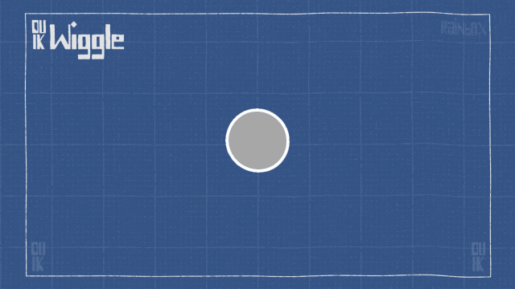

#  Automations

Automations, automatic animations, dynamics, physics, procedural animation.

## Introduction

As soon as your character is rigged, you can begin the animation, being helped by a lot of Automations. **Automations are procedural animations and dynamics** to quickly set the most common animations up and then focus on the characterization of your character. You can automate wiggles, springs, wheels, etc. with customizable and advanced controls for example to loop the effects, and access each and every detail quickly and easily.

## Panel

Duik includes a lot of tools to help animators deal with simple or common animations, to make them quicker and focus more on complex character animation.

-  The [***Kleaner***](kleaner.md) is a tool to automatically clean the selected animations.  
-  The [***Motion Trail***](motion-trail.md) tool draws the trajectory of any layer in a shape layer, and can make trails behind (or in front of) them.
-  The [***X-Sheet***](x-sheet.md) is a simple way to adjust the animation exposure of the properties, the layers or the whole composition.
-  The [***Time Remap***](time-remap.md) is a quick way to activate time remapping on the layers while adding some useful expressions, like looping.
-  The [***Effector map***](effector-map.md) is a way to control properties depending on a texture (map).
-  The ***[Effector](effector.md)*** is a way to control properties depending on a spatial effector.
-  The ***[Wiggle](wiggle.md)*** makes the properties... wiggle.
-  The ***[Spring](kleaner.md)*** will add *follow through*/*overshot* to your animations and it is able to animate automatic bounces. It actually uses the [*Kleaner*](kleaner.md).
-  The ***[Swing](swing.md)*** can be used to animate a regular swing. For example, the regular blinking of a light or a pendulum.
-  Use the ***[Blink](blink.md)*** to make a property switch regularly between to states, without interpolation.
-  The ***[Wheel](wheel.md)*** automates the rotation of the layer depending on its translations.
-  The ***[Move Away](move-away.md)*** tool will add a simple cursor which controls the position of the layer. This cursor will control the distance between the layer and its parent.
-  The ***[Random](random.md)*** tool is able to randomize all kind of things (property values, keyframe times, layer times...)
-  Use the ***[Paint Rig](paint-rig.md)*** to rig brush strokes in the paint effect and adjust and animate them as if they were a single stroke.
-  The ***[Walk Cycle](walk-cycle.md)*** is the first comprehensive procedural animation available in Duik.
-  Use the ***[Looper](looper.md)*** to add in and out loops to the animations.
-  The ***[List](duik-list.md)*** divides a property into several same properties, which can be mixed using a weight. This is a simple way to add several automations to the same property, or use some kind of "Animation Layer".
-  [***Separate Dimensions***](separate-dimensions.md) allows you to separate X and Y axis of any property (or even RGB and HSL for colors).