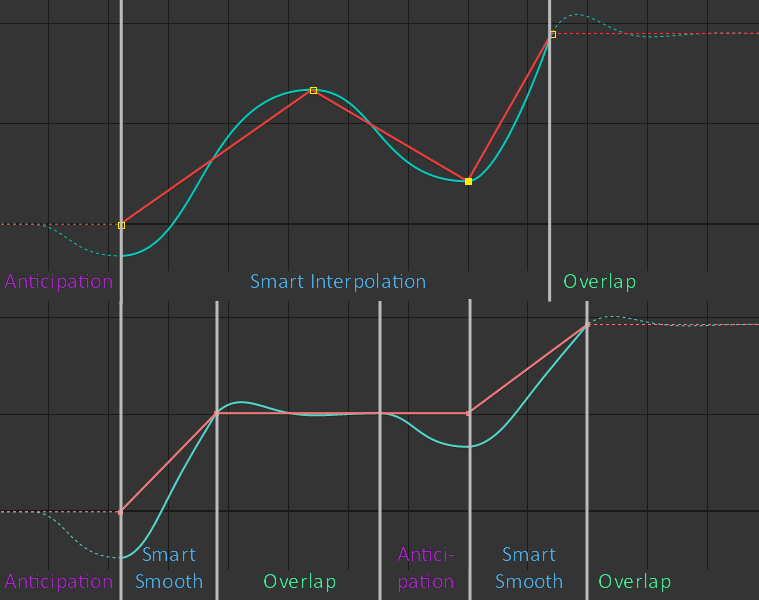
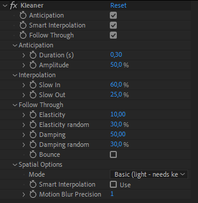

##  Kleaner

The "Kleaner" is a tool to automatically clean the selected animations.  
It removes unnecessary keyframes (keyframes which do not result in any animation), and generates and controls **anticipations**, **interpolations** and **follow-through** of the animations.  
With the kleaner, you don't have to work on keyframes interpolations anymore, and you don't even have to animate anticipations and follow-through by hand. You just have to add some keyframes, keep them linear, and tweak the settings of the kleaner, which will automatically generate all of these for you.

After having removed unnecessarry keyframes, it works with an expression which is controlled by an effect.

### Use

1. Select the keyframes of the animation you want to clean.
2. Click on the "Kleaner" button.

One effect is created for all selected properties of the same layer. That means all properties will be controlled by the same values. If you need different values for several properties, create a new kleaner for each one of them.

### Effect

The effect is used to control each part of the animation.

Within the effect, you can teak each part with individual settings. The Kleaner will automatically adapt to your animation.

Use the checkboxes to (de)activate any part of the automation, and adjust the details in each section.

!!! tip
    You can animate these checkboxes to use *anticipation* or *follow through* only at specific times of your animation.

#### Anticipation

The anticipation is the motion which happens before the beginning of the actual animation. It should happen only on living characters, inanimate objects don't have anticipation in their movements.  
You can adjust the *duration* (in seconds) and the *amplitude* of this specific movement.

#### Interpolation

The kleaner automatically smoothes your animation, and the result is very fluid. Adjusting the *Slow In* and *Slow Out* values changes the way the animation starts and stops, or makes sharp turns.  
Usually, a living character has a lower *Slow Out* and a higher *Slow In*. These values also change depending on the weight of the object: heavier objects and characters have higher *Slow Ins and Outs*.

#### Follow Through

Follow Through happens when the animation comes to a stop; it's the momentum of the object, which makes it "bounce" at the end of the movement, going a bit to far away and getting back to its stop.

The elasticity controls the frequency and the amplitude of this motion. A higher elasticity generates a faster and smaller movement.

The Damping controls how long it takes for the animation to fully stop. A higher value will make it stop sooner. At 0, the movement never stops.

For both these values, you can add some randomness: this means each property controlled by this kleaner effects will have a slightly different motion, which looks more natural.

Use the bounce checkbox to make the object bounce back at the value where it should stop, like a ball bouncing on the floor.

#### Spatial options

For multi-dimensionnal properties, you can adjust the spatial options. By default, the kleaner will not adjust the interpolation of these, letting you work the trajectories in After Effects.  

When changing the mode to "Simulation", the follow through will take the true movement of the layer into account when it's computed, but the computation will be much slower. When it's set to "Basic", the follow through only happen if the property is actually animated and has keyframes.

!!! tip
    Use the kleaner on some Puppet Pins and switch the mode to "Simulation", then animate the position of the layer. This is a quick and easy way to animate soft bodies!

!!! hint
    All these values can be animated!

### Additional Panel

- Remove unnecessary keyframes:  
  Check or uncheck the checkbox to activate or deactivate this step when you run the "Kleaner"
- Separate Dimensions:  
  In case you add the kleaner on multi-dimensionnal properties, you can check this option to separate the dimensions first, and control separately each axis.